# INFO 6205 Final Project

| Name                  | NUID      | E-mail                     |
| --------------------- | --------- | -------------------------- |
| Feifan Tai            | 002138099 | tai.f@northeastern.edu     |
| Zifeng Xu             | 001045590 | xu.zif@northeastern.edu    |
| Noctis Yamazaki Zhang | 002105657 | zhang.noc@northeastern.edu |

**Extract** Using existing conventional simple sorting algorithms to sort Chinese strings can impose unforeseeable issues, and they could suffer greatly from maintaining a high accuracy rate. In this project, we are aiming at exploring tangible ways to sort strings fulfilled with Chinese characters in Pinyin or Stroke order with user-defined data structure. In this report, we wall walk through the advantages and disadvantages of the custom-defined data structure which we used to adapt to various sorting algorithm while achieving high accuracy and efficiency. This special user-defined sorting algorithm generally has a better accuracy than conventional sorting algorithm such as Quick Sort, while it does not require a high memory runtime usage. Such algorithm can also effortlessly extend to other string sort instances which contains character-based languages such as Korean, Japanese, and Thai.

## 1. Introduction

Sorting is a behavior which seems natural to we human beings. It is highly integrated into our daily life. While sorting objects or elements, we separate and categorize them based on the similarities and differences. In this way, it enables us to index items in a defined order for quick locating and comparison in the future. Therefore, searches become less time-consuming sequential searches. String sort is the foundation of many data science and management applications which involve large-scale data. Hence, it is inevitable that string sorting is a crucial practice.

We need to acknowledge that the East Asian languages are several degrees more complex than European languages such as English, French, and Spanish. For instance, when it comes to English, the language consist of twenty-six alphabets. In order to make a meaningful representation, it requires multiple alphabets to make a unique representation. However, when it comes to Chinese language, there are roughly fifty thousands characters. The character itself can represent a special meaning. 


> Source : [English language, alphabet and pronunciation (omniglot.com)](https://omniglot.com/writing/english.htm)


> Source :  [Chinese characters - Wikipedia](https://en.wikipedia.org/wiki/Chinese_characters)

It is implausible for anyone to develop a design of input peripherals to accommodate the needs of inputting different Chinese characters into computer systems. However, there are two possible approaches that we can rely on to access the Chinese character, which we desire: the stroke-based input method and the pinyin-based input method. Both systems have left strong presentations in the twentieth century. However, as Simplified Chinese is becoming increasingly dominant, the stroke-based input method is slowly fading away due to its high requirement for memorization and low input speed. Therefore, the primary way to learn Chinese characters is to understand their pinyin presentation in the modern era. Yet, it is still necessary to utilize a stroke-based sorting algorithm when two characters share the same pronunciation where the pinyin and tone are identical. Hence, it is safe to conclude that to master the accuracy of Chinese string sorting, factoring pinyin-based and stroke-based sorting is necessary.

In this paper, we will study various sort algorithms and discuss the advantages and pitfalls of different user-defined Chinese string sorting methods to form a deep understanding of the complexity of the task. In addition, we will look into the time and space complexity and the potential improvement which we could conduct in future studies.

 ## 2. Relative Studies

To tackle the difficulties in sorting Chinese string, there are multiple aspects which we need to explore in the study: sort complexity, sort order, and potential edge cases which we could encounter in the reality.

### 2.1 Sort Complexity

There are several sorting established sorting algorithms existing in the wild, and most of them are comparison based sorting algorithms such as <cite>[Quick Sort][1]</cite>, as well as <cite>[Insertion Sort][2]</cite>. However, due to the need of making comparisons while sorting the objects, the complexity of Insertion Sort is $O(n^2)$. When it comes to Quick Sort, it has the advantages in reducing the number of traversals needed, and the average runtime is $O(n*lg(n))$ and the worse case runtime would still remain as $O(n^2)$. Another accelerated sorting algorithm named <cite>[Dual-Pivot Quick Sort][3]</cite> can achieve an average performance of $O(n)$ for uniformed data, and $O(n*lg(n))$ for random inputs. Since we usually has no control over the ordering of the original data, we need to rely on other algorithms to reduce the likelihood of degeneration of runtime. Therefore, sorting algorithms which requires no comparison become compelling to us. <cite>[Radix Sort][4]</cite>, a non comparison-based sort algorithm has a runtime complexity of $O(d*n)$ even though the data is uneven. Therefore, we should have the expectation that the Radix based sorting algorithm shall be able to yield the best performance among other sorting algorithms. 

### 2.2 Sort Order

When it comes to sorting Chinese strings, the conventional invariance of the sort process is that each word shall be treated separately when they are represented in its original format as a 'char' type data. Traditionally, we would simply sort the string in a sequential order by sorting the whole list based on character at each index value. For instance, if we denote the Chinese string as $ABC$ where each letter represents a Chinese character. Usually, we would sort the set of string from the left to right in the following sequence.

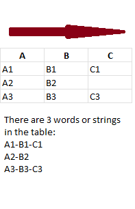

To sort the set of strings which contains maximum of three characters, we will start the sort process from the first character, which is $A$ in this case scenario. Once the set of array is sorted, we will move onto the next character namely $B$, and repeat the same procedure. Then, we sort the set of array based on the last character $C$. The figure below can illustrate the sorting sequence effectively.


In this manner, we would need to traverse the array for a maximum of $3n$ times to ensure that the set of data is sorted correctly. To reduce the complexity, we will need to construct a special data structure which enables us to sort the string in one pass ideally, or eliminate the comparison required during sort process completely to sustain both high accuracy and low complexity.

### 2.3 Potential Issues

For English words, each word has one unique pronunciation under the same language system. Though the sounds for a particular word can differ slightly due to the variation of dialects, we can easily recognize the word and come up with a unique spelling. The only difference in spelling would happen when we compare American English and British English. For instance, 'color' and 'colour' are referring to the same word. However, when it comes to Chinese, the same word would have drastically diverse pronunciations. For example, when we look at the Chinese character '<cite>[重][5]</cite>', it has two pronunciations with different meanings.

| 重   | Pinyin | Meaning    |
| ---- | ------ | ---------- |
| 1    | chóng  | Duplicated |
| 2    | zhòng  | Heavy      |

 There is no defined rules in terms which pronunciation we should select when the character is represented in name or other text. As the solution of the issue is case-oriented, it is highly possible that the result generated by existing algorithms and applications contains biases.

In addition, there can also be multiple words linked to the same pronunciation in Chinese characters. For instance, when it comes to '<cite>[sān][6]</cite>', there can be multiple Chinese characters share the same pinyin format, such as '三', '叁', and '叄'. They are all commonly used in Chinese language. As a result, sorting Chinese strings based on pinyin and tone is not sufficient enough to yield correct and definitive ordered result. Other options must be explored to enhance the accuracy of the sort order.

## 3. Sort Algorithm Based On User-Defined Order

In the first part, let us discuss about the data structure which our application is relying on to address the potential issues discussed in **Section 2**. Then, we will walk through the workflow of the sort application.

### 3.1 Data Structure

#### 3.1.1 Constructing Unique Identifier String For Each Unique Chinese String in Pinyin Order

To convert the raw Chinese strings into easily comparable form, we can first consider converting each character into its pinyin format. To enhance the accuracy, we would translate them into a sequence of English letters coupling with a tone number at the end of the string. Let us take '三' as an example again, instead of representing it as 'sān', we will in turn denote it as 'san3' for easy comparison. In order to address the issues mentioned in **Section 2.3**, we would like to introduce the stroke number into consideration. To do so, we constructed a database which contains the number of strokes along with its stroke sorting index for one single character.

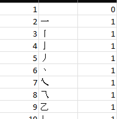

Since Chinese is a pictograph, the best way to get the number of strokes is to make a mapping table. So the first thing is to output all the Chinese character in the Unicode from `U9FA6` to `U9FBF` as a `csv` file. Then we use the stroke sorting function of Excel to sort Unicode and Chinese characters. And then we found that there was something like a positive correlation between Unicode size and strokes overall .So we wrote a simple program to sweep through the approximate number of strokes of Chinese characters. The next step is to determine the range of strokes manually one by one.

However, there can be cases where the Chinese characters share the same pronunciation and stroke number, for instance, '晖' and '珲' both share a pinyin and tone format of 'hui1', and their stroke numbers are both 10. Then the absolute index value of a given Chinese character becomes important in ruling out the biases.


In the figure above, we can see that there are two entries which share the same pinyin plus tone formatted string. In order to differentiate them, based on the given information, we have constructed a unique storage structure string to present each character as:


* Pinyin: maximum of **6-letter English string**
  * Since the maximum length of pinyin of a Chinese word is 6 English letters long, we should expect 1 to 6 English letters occupying the first block of the storage string.

* Tone: fixed **1-digit integer value**

  * There are 5 tones in the Simplified Chinese pronunciation: 

    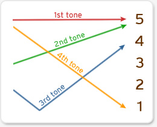

    > [Tones | Chinese Pronunciation | ChinesePod](https://www.chinesepod.com/tools/pronunciation/section/17)

    Therefore, we should expect 1-digit long integer occupying the second block of the storage string.

* Number of stroke: fixed **2-digit integer value**

  * As the third block is located between two integer blocks, it is important to differentiate them by making the third block with a fixed length to avoid potential truncation issues. As the maximum number of strokes stored in the lookup database table is less than 100, it is natural for us to define the third storage block as 2-digit long integer value.

* Stroke index: fixed **5-digit integer value**

  * The maximum number of the stroke index table is less than 30000, to avoid truncation issues, we need to define this block as a 5-digit long integer value.

In this way, a Chinese character can be represented in a unique order-able and identifiable storage string. For instance, for '冰', it has a unique identifier as `bing10601082`. In this way, there is no long need to store the name into separated cells in an array as `[[A], [B], [C]]`. Instead, we can concatenate them into one unique identifier string for each unique Chinese string. In this way, we can accelerate up the sorting speed while gaining unmatchable accuracy.

#### 3.1.2 Constructing Unique Identifier String For Each Unique Chinese String in Stroke Order

When it comes to stroke-based sort order, it is rather easy to define the unique identifier string as a maximum of 15-digit long integer value since the maximum number of the stroke index table is less than 30000. However, to avoid truncation issues, we need to pad the second and third character's index values into 5-digit long integer values.


In this way, rather than using non comparison-based sort algorithm, we could still achieve strong sort speed by utilizing multi-threading techniques.

### 3.2 Reference Catalog

The reference catalog which designed to store single Chinese character is stored in the SQLite database in a single table. The table has a schema as:

```sqlite
catalog:
CREATE TABLE catalog(
_id INTEGER PRIMARY KEY,
character TEXT,
num_stroke INTEGER NOT NULL,
pinyin_tone_stroke TEXT
);
```

The `_id` column is the stroke index for the particular Chinese character, the `character` column stores the actual Chinese character in its native form, the `num_stroke` column stores the number of strokes of the reference Chinese character, and the `pinyin_tone_stroke` column contains the unique storage string mentioned in the **Section 3.1.1**. Such data was generated in Java with the help of Java library named `pinyin4j`. By doing so, we only need to perform quick lookup table actions to reduce the conversion time for all characters in the Chinese string. In this way, we can reduce the library call time greatly.

### 3.3 Input Directory

For the Chinese strings stored in the `shuffledChinese` directory, after removing irrelevant entries stored in the `txt` file, we convert it into database table as `inputs`.

```sqlite
.schema inputs
CREATE TABLE inputs(
orig_name TEXT NOT NULL,
first_char TEXT NOT NULL,
second_char TEXT NOT NULL,
third_char TEXT
);
```

We separate the Chinese name into three partitions, do note that the minimum length of a Chinese name in the `txt` file is 2, and maximum length is 3. Therefore, we set the `third_char` column to be able to take `null` value.

### 3.4 Generate Storage String

To achieve quick conversion time for all Chinese characters, we designed the conversion result table as `converted`:

```sqlite
sqlite> .schema converted
CREATE TABLE converted(
orig_name TEXT,
full_stroke BIGINT,
pinyin_stroke_full TEXT
);
```

In this way, we can quickly obtain the original Chinese name in the table as `orig_name`, and the `full_stroke` column contains the storage long value mentioned in **Section 3.1.2**. Besides, the `pinyin_stroke_full` column stores the storage string mentioned in `Section 3.1.1`.

The computation process can be triggered by Java as SQL queries as:

```sqlite
INSERT INTO converted (orig_name, full_stroke, pinyin_stroke_full) 
SELECT orig_name, 
(catalog1._id * 10000000000 + catalog2._id * 100000 + catalog3._id), 
(catalog1.pinyin_tone_stroke) || (catalog2.pinyin_tone_stroke) || SUBSTR('0000'||catalog2._id, -5, 5)  || (catalog3.pinyin_tone_stroke) || SUBSTR('0000'||catalog3._id, -5, 5) 
from inputs i 
INNER JOIN catalog catalog1 on i.first_char = catalog1.character 
INNER JOIN catalog catalog2 on i.second_char = catalog2.character 
INNER JOIN catalog catalog3 on i.third_char = catalog3.character;
```

Do notice that an optimization was made to help reducing the length of the unique identification string with the format mentioned in `Section 3.1.1`, the first Chinese character represented in the table, which is the surname or last name of a Chinese name, will extremely less likely to cause any issues mentioned in `Section 3.1.1`. Therefore, we could omit the stroke index number for the first Chinese character in each string. In this way, the overall size of the database reduced from 85105 KB to 79676 KB without sacrificing the accuracy rate.

Once the tables are constructed, the unique identifier storage strings are pulled from the database by the usage of `SELECT` statement to feed into various sorting algorithms with <cite>[references][7]</cite>.

## 4. Observations and Benchmarks

We performed unit tests and benchmarks for various sort algorithms.

`HuskySort:`


`TimSort:`

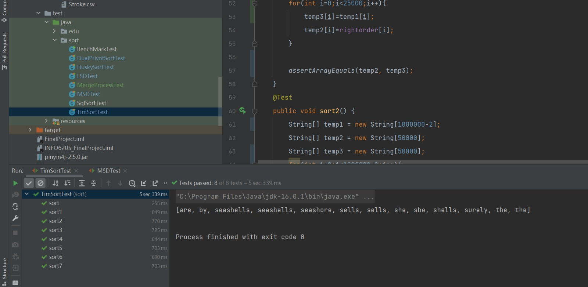


`MSD RadixSort:`

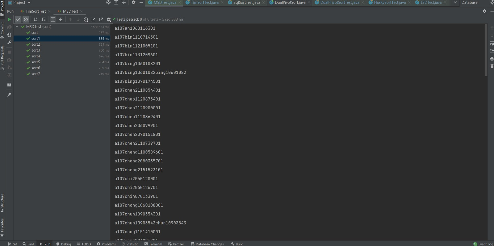

`Dual-Pivot Sort:`

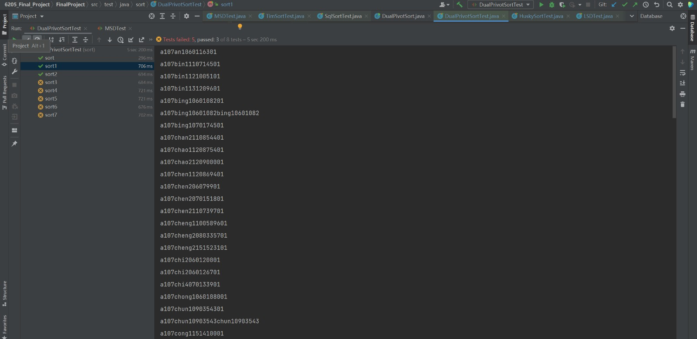

`SQL Order Sort:`

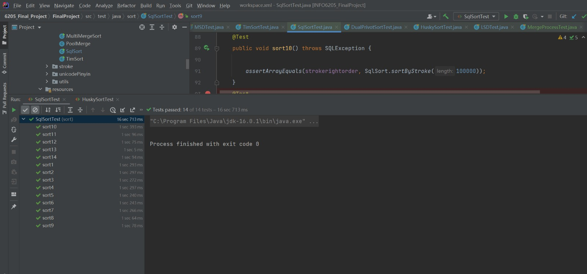

`Benchmark:`

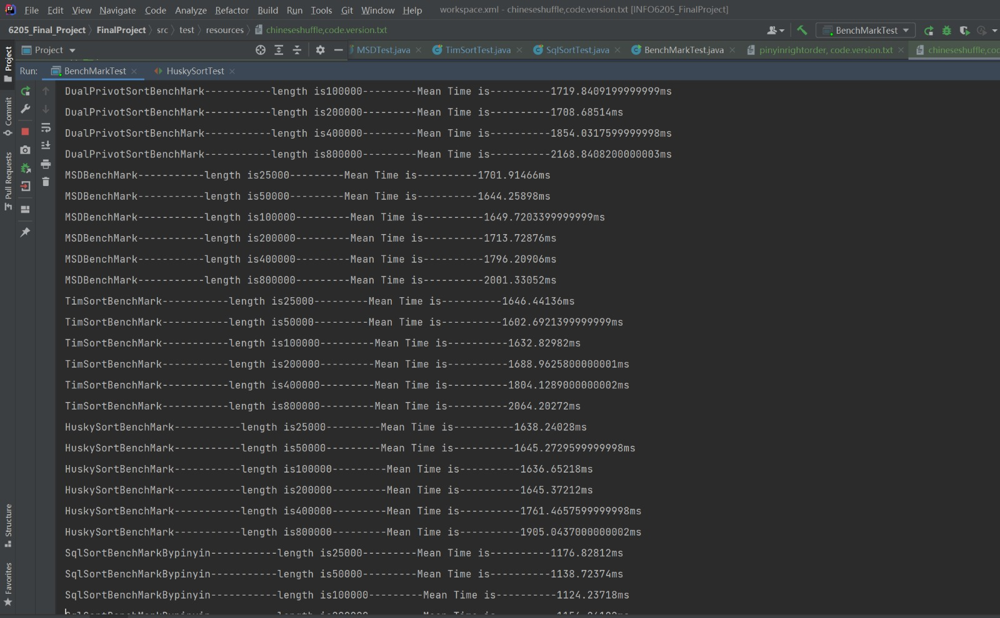

These sorting algorithms could achieve the same level of accuracies for the given valid `999998` Chinese strings archived in the `shuffledChinese.txt` file. The runtime of which can be seen as:

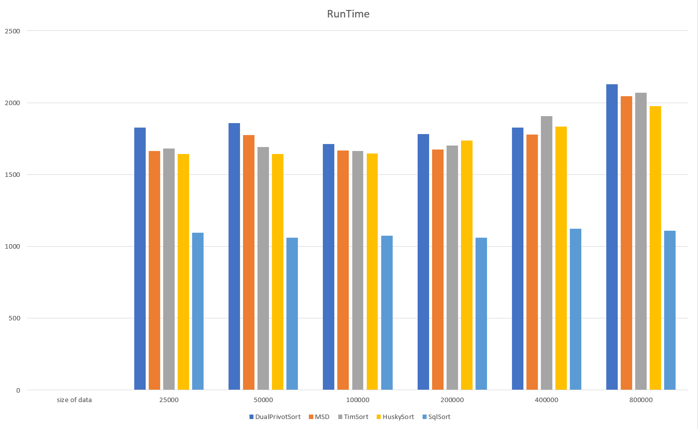

And a linear comparison can be seen as:

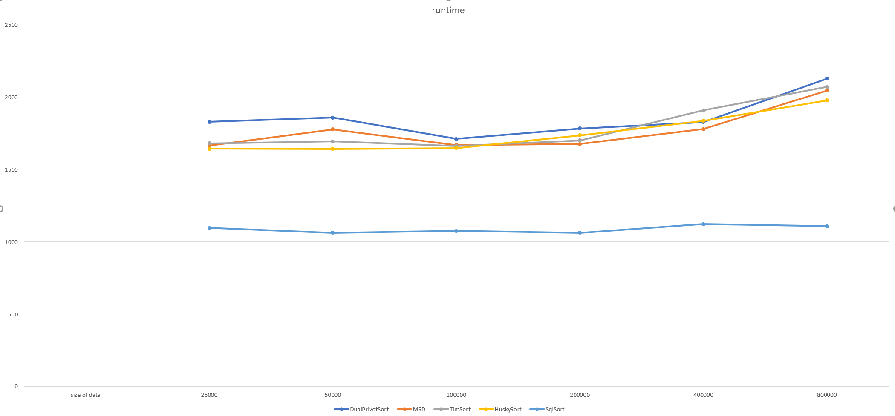

## 5. Conclusion

Based on the results, we can clearly see that MSD Radix Sort has far more superior sort speed while comparing with others. Since this type of method checks the characters in the key from left to right, first looking at the most significant character. The attraction of high-end string sorting is that they do not necessarily need to check all the input to complete the sorting.

High-end-first string sorting is similar to quick sorting, because they both divide the array to be sorted into independent parts and recursively process the sub-arrays in the same way to complete the sorting. The difference between them is that the high-end string sorting algorithm only uses the first character of the key when segmenting, while the quick sort comparison involves all the keys.

However, it is evident that SQL ORDER BY Sort is far more superior due to its pipelined execution to achieve efficient pagination. The B-Tree traversal is the first power of indexing, and the clustering is the second power of indexing. Therefore, in the future, in order to achieve faster sort speed, we should consider using tree structures to store the input and reference tables.

Out of our curiosity, we also made a comparison between the stroke-based sorting algorithms. Single threaded Merge Sort and Multi-threaded Merge Sort are put into comparison. We were able to yield:

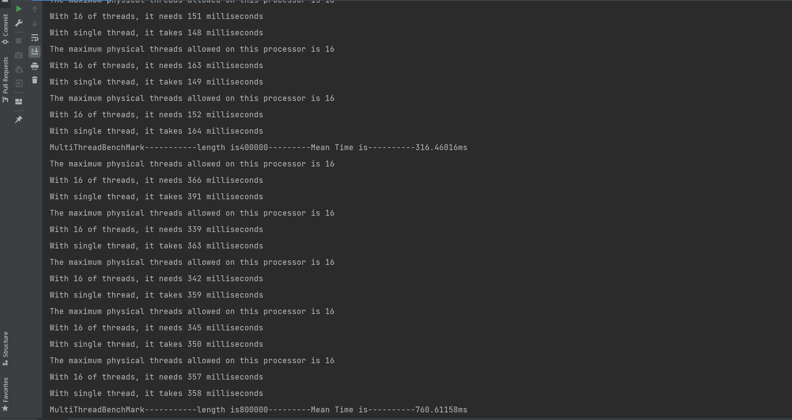

It is clear that the sorting algorithm is benefitting from the utilization of multiple threading in sorting though there is a universal merge at the end of the process.

Therefore, in the future if possible, we contend that the fastest Chinese sorting algorithm would be a combination of our identifier storage string and B-Tree data structure to achieve faster sort speed. And storing data in conventional array format is not an efficient manner to store large-scale data.

##  


[1]: Hore C. Quicksort [J]. *The Computer Journal* 1962, 5(1):10-16  

[2]: Knuth D. *The art of computer programming. Vol. 3: Sorting and searching*. Addison Wesley, 1973.

[3]: Wild, Sebastian & Nebel, Markus & Martínez, Conrado. Analysis of Pivot Sampling in Dual-Pivot Quicksort. Algorithmica, 2014. 75. 10.1007/s00453-015-0041-7.

[4]: Cormen TH, Leiserson CE, Rivest RL et al. Introduction to algorithms (2nd Ed). Cambridge MA: MIT Press; 2001.  

[5]: *重*. 维基词典，自由的多语言词典. (n.d.). Retrieved December 6, 2021, from https://zh.m.wiktionary.org/zh-hans/%E9%87%8D. 

[6]: *三*. 维基词典，自由的多语言词典. (n.d.). Retrieved December 6, 2021, from https://zh.m.wiktionary.org/wiki/%E4%B8%89. 

[7]: *算法#12--详解各种字符串排序算法和代码实现*. 算法#12--详解各种字符串排序算法和代码实现_tclxspy的博客-CSDN博客. (n.d.). Retrieved December 6, 2021, from https://blog.csdn.net/tclxspy/article/details/52596559. 